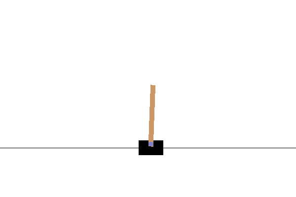

[HOME](https://github.com/namjiwon1023/Code_With_RL)

# Deep Q-learning

여기서는 Q-learning 에 기반한 알고리즘들을 다루고, 이러한 알고리즘들을 통합적으로 적용하여 성능을 개선한 Rainbow 까지 살펴본다.

## DDQN

Van Hasselt, Hado, Arthur Guez, and David Silver. "Deep reinforcement learning with double q-learning." Thirtieth AAAI Conference on Artificial Intelligence. 2016.​

​	[`PAPER`](https://arxiv.org/pdf/1509.06461.pdf)	|	[`CODE`](https://github.com/namjiwon1023/Code_With_RL/blob/main/Double%20DQN/agent.py)

 

- Key idea: Q-value 가 튀었을 때 그 에러가 바로 퍼지지 않도록 방지책을 두자

Q-learning 이 갖는 고질적인 문제점 중 over-estimation bias 라는 문제가 있다. Q-learning 에서 target 을 계산하기 위해 max 를 사용하기 때문에 발생한다. Stochastic 한 환경에서, 별로 좋은 state 가 아닌데 어쩌다 reward 가 좋게 튀었다고 생각해보자. 이 경우 Q-value 가 바로 좋은 값으로 업데이트되는데, 이 값이 운좋게 얻어걸린 값이라는걸 알기까지 여러번의 추가 방문이 필요하고, 이 동안 이미 이 잘못된 Q-value 가 다른 state 들로 다 전파되어 돌이킬 수 없는 상태가 된다.

이 문제를 해결하기 위해 나온 방법이 double Q-learning 으로, Q-function 을 2개 사용하여 어쩌다 Q-value 가 좋은 값으로 튀더라도 바로 다른 state 들로 전파되지 않게 막는다. 

*Pseudo code of double Q-learning*

위는 서튼책에서 가져온 double Q-learning 의 수도코드다. 이와 같이 Q-function 을 2개 사용하고, 실제로 target 값을 계산하는 Q-function 과 maximum action 을 결정하는 Q-function 을 분리한다. 따라서 두 함수중 하나가 잘못된 값으로 "튀어" 있는 상태더라도 최종적으로 계산되는 target 값은 정상적인 값이 나오게 된다.

Double DQN 은 이 아이디어를 그대로 가져온다. DQN 에서는 freeze target network 를 도입하면서 이미 2개의 네트워크를 사용하고 있으므로, 이를 그대로 사용한다.

 는 freezed target network parameter 를 가리킨다.

### [Trained Results]

