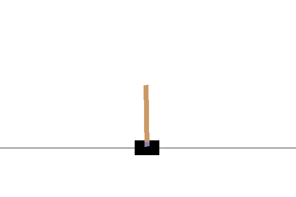

[HOME](https://github.com/namjiwon1023/Code_With_RL)

# Deep Q-learning

여기서는 Q-learning 에 기반한 알고리즘들을 다루고, 이러한 알고리즘들을 통합적으로 적용하여 성능을 개선한 Rainbow 까지 살펴본다.

## Dueling DQN

Wang, Ziyu, et al. "Dueling network architectures for deep reinforcement learning." arXiv preprint arXiv:1511.06581 (2015).

​	[`PAPER`](https://arxiv.org/pdf/1511.06581.pdf)	|	[`CODE`](https://github.com/namjiwon1023/Code_With_RL/blob/main/Tutorials/D3QN/network.py)

 

- Key idea: Advantage function A(s,a)

Q-learning 은 어떤 state s 에 대해 각 action a 의 state-action value function Q(s,a) 를 사용한다. 즉, state 가 주어지면 모든 action 에 대해 action value 를 계산해야 한다. 하지만 어차피 같은 state 라면 비슷한 가치를 지닐텐데, 굳이 각 action value 를 따로따로 계산할 필요가 있을까? Dueling DQN 은 Q(s,a) 를 바로 추정하는 대신 V(s) 와 A(s,a) 를 추정하여 Q(s,a) 를 계산하는 방식으로 value function 의 variance 를 잡는다.

아래는 이를 위한 네트워크 구조로, V(s) 와 A(s,a) 는 네트워크 파라메터를 상당 부분 공유할 수 있다.

위는 기존 DQN 의 Q-network. 아래는 Dueling DQN. V 와 A 값을 각각 예측하여 Q 를 만들어낸다.

### [Trained Results]

