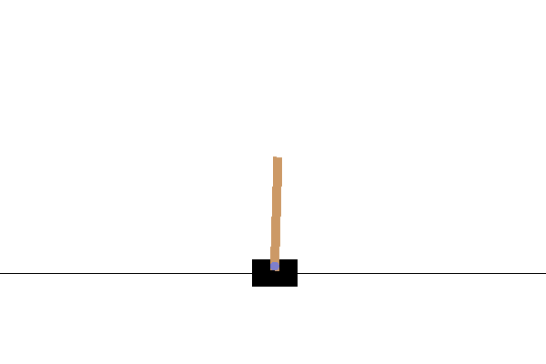

# Deep Q-learning

여기서는 Q-learning 에 기반한 알고리즘들을 다루고, 이러한 알고리즘들을 통합적으로 적용하여 성능을 개선한 Rainbow 까지 살펴본다.

## NoisyNet

Fortunato, Meire, et al. "Noisy networks for exploration." arXiv preprint arXiv:1706.10295 (2017).

​	[`PAPER`](https://arxiv.org/pdf/1706.10295.pdf)	|	[`CODE`](https://github.com/namjiwon1023/Code_With_RL/blob/main/Tutorials/Noisy%20Network/network.py)

 

- Key idea: Learnable exploration

RL 에서 항상 강조되는 이슈 중 하나가 바로 exploration-exploitation problem 이다. 어떻게 하면 exploration 을 잘할 수 있을 것인지도 주요한 연구 분야중 하나다. 그런데 지금까지 exploration 을 하는 방식을 보면 가장 기본적인 epsilon greedy 방식을 적용하고 있다. 이를 좀 더 잘해볼 수 없을까?

NoisyNet 은 네트워크의 weight 에 perturbation 을 주어 exploration 을 강제한다. 흥미로운 점은 이 perturbation 을 주는 파라메터가 learnable parameter 가는 점이다. 학습 과정에서 이 perturbation 정도가 알아서 조절된다.

보통 네트워크의 최종 output 인 Q-value 를 계산하는 네트워크 마지막 단에는 linear layer 가 붙는다.

여기에 noise 를 주어 흔들면:

이를 그림으로 표현하면 다음과 같다:

여기서  와  는 learnable parameter 이고,  은 학습이 안 되는 noise 에 해당한다.

### [Trained Results]

