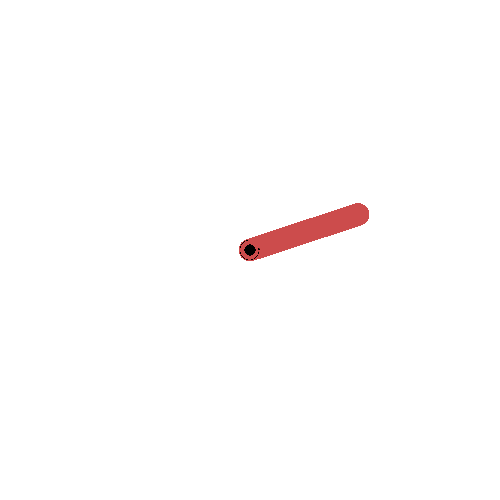

[HOME](https://github.com/namjiwon1023/Code_With_RL)

### DDPG

[Continuous control with deep reinforcement learning]

Timothy P. Lillicrap∗ , Jonathan J. Hunt∗ , Alexander Pritzel, Nicolas Heess, Tom Erez, Yuval Tassa, David Silver & Daan Wierstra (2016)

​	[`PAPER`](https://arxiv.org/pdf/1509.02971.pdf)	|	[`CODE`](https://github.com/namjiwon1023/Code_With_RL/blob/main/tutorials/DDPG/algorithm/agent.py)

 

### [Abstract]

- <u>Deep Q-Learing에서의 성공의 기반이 되었던 주요 아이디어들을 채용해 **continuous action domain**으로 옮겼다.</u>

- deterministic policy gradient기반의 actor-critic, model-free 알고리즘이 continuous action spaces에서도 잘 돌아간다는 것 보인다.
- 동일한 학습 알고리즘, network 구조, hyper-parameter를 이용해 20가지가 넘는 물리 시뮬레이션 task를 모두 풀어냈다.
- 이 알고리즘은 이제 dynamics기반의 planning 알고리즘과 비교해 충분히 경쟁적인 성과를 내는 policy를 찾아낸다.

 

### [Introduction]

AI분야의 본래 목적 중 하나는 바로 **가공되지 않은 고차원의 센서 데이터를 이용해 복잡한 문제를 푸는 것**이라고 할 수 있다.

최근에는 센서데이터 처리를 위해 발전된 딥러닝 기술을 사용하기 시작했으며, 이것이 강화학습과 결합되어  Deep Q-Network가 탄생하게 되었다.

 

그러나 DQN은 high-dimensional observation spaces를 이용해 문제를 풀지만, **discrete하고 low-dimensional action spaces만을 다룰 수 있었다**.

때문에 DQN에서는 continuous domain문제에 적용하기 위한 방법으로 action space를 discrete한 action으로 쪼개어 적용하였다.

그러나 이러한 방법은 많은 **한계점(limitations)** 을 지닌다. 바로 **차원의 저주(the curse of dimensionality)** 때문이다.

 

이 논문에서는 <u>deep function approximator를 이용한 model-free, off-policy actor-critic algorithm</u>을 제안한다. 

해당 논문에서는 deterministic policy gradient(DPG) 개념이 바탕이 되었는데,

고전적인 actor-critic방식에 neural function approximator를 결합하는 방식으로는 어려운 문제에 대해 상당히 불안정했다고 한다.

그래서 이번에는 **DQN에 적용되었던 Insights들을 actor-critic 방식에 적용**해 그 문제를 해결하였다.

 

DQN의 이전에는 large, non-linear function approximator가 어렵고 불안정하다는 사실이 일반적이었다.

하지만 DQN은 **두 가지 innovation**을 통해 stable하고 robust한 방법으로 이러한 function approximator를 이용하 value function을 학습시킬 수 있었다.

- 첫번째는, **replay buffer**를 이용해 관련성이 적은 sample들만을 off-policy 방법으로 network를 학습시킨다.

- 두번째로, **target Q network**를 이용해  TD backup(update)을 하는 동안에 target에 대한 일관성을 유지시켜준다.

또한, 이 논문에서는 위 두가지 아이디어와 함께 **batch normalization** 개념이 함께 적용되었으며 

이것이 바로 논문의 결과물인  **Deep DPG(DDPG)** model-free approach이다.

 

### [Background]

#### **Notation**

 

action-value function은 많은 강화학습 알고리즘에서 사용된다. 

이는 아래의 식과 같이 policy를 따라 방문하게되는 action, state에서 얻게 될 모든 return의 기댓값이다.

위 식은 일반적으로 **Bellman Equation**이라 알려져있는 recursive relationship 방식으로 표현되곤 한다.

만약 target policy가 deterministic하다면 action-value function 식 내부의 기댓값을 없앨 수 있으며 policy 역시 다음과 같이 표현된다.

기댓값은 오직 환경(state,reward)에만 의존적이다.

이는 또다른 stochastic behavior policy로부터 생성된 sample을 이용해 off-policy방식으로 위 함수를 학습할 수 있음을 의미한다.

 

우리는 위 action-value function을 근사할 **function approximator를 파라미터화** 하여 생각해 볼 수 있을 것이다.

또한 근사함수를 최적화 하기위해 아래 식을 이용해 loss를 구하고 이를 최소화 해야만 한다.

 

value function이나 action-value function을 학습하기 위해 large, non-linear function approximator를 사용하는것은 예전부터 기피의 대상이었다.

가능성을 보장할 수 없을 뿐더러 실제로 불안정한 경향이 있었기 때문이다.

하지만 근래에 large neural network를 function approximator로서 효과적으로 사용한 DQN이 등장했으며,

그를 성공시킬 수 있었던 주요 아이디어로 ***replay buffer*와 *target network***가 소개되었다.

 

이 논문에서는 DDPG에 이러한 개념들을 적용하였으며 상세한 내용은 다음 섹션에서 소개된다.

 

### [Algorithm]

<u>Q-learning을 continuous action spaces로 그대로 적용하기는 불가능했다</u>.

greedy policy로 continuous spaces를 탐색하기에는 매 스탭마다 모든 action에 대해 optimization을 진행해야했고,

이 과정이 large, unconstructed function approximator에 적용하기에는 **매우 느렸기 때문**이다. 

 

그 대신에 이 논문에서는 DPG algorithm의 기반이 되는 **actor-critic 방식**을 이용했다.

DPG에서는 actor function을 파라미터화하여 관리하였고, actor의 policy에서는 state와 특정 action을 직접적으로 연결해주었다.

critic은 bellman equation을 이용한 Q-learning 방식으로 학습되었고, actor는 policy performance의 gradient 방향으로 update 되었다.

 

Q-learning과 함께 non-linear function approximator를 사용한다는 것은 '수렴을 보장하지않는다' 라는 것을 의미한다.

그러나 **large state spaces에 대해 일반화를 하고 학습을 시키기 위해서는 이러한 approximator가 필수적**이다.

*NFQCA(Hafner & Riedmiller, 2011)* 에서는 DPG와 같은 update rule을 사용하였지만 neural function approximator를 사용하였다.

안정화를 위해 batch learning을 사용했지만 large network에서는 사용하기가 어려웠다.

 

이 논문의 contribution은 <u>DQN이 성공할 수 있었던 요인들을 착안하여 DPG를 조금 개선한 것</u>이다.

이것을 이 논문에서는 **Deep DPG(DDPG)** 라 부른다.

 

#### replay buffer

neural network와 강화학습을 접목시킬 때 마주치는 **첫번째 관문**은 바로,

대부분의 최적화 문제가 <u>sample들이 독립적이며 뚜렷하게 분포되어있다고 가정해버린다는 것</u>이다.

확실한 것은 환경을 꾸준히 탐험할 때에 생성되는 sample들을 더이상 이러한 가정 하에 두지 않게 된다는 것이며,

hardware 최적화를 효과적으로 사용하기 위해 online보다는 mini-batch를 사용해 학습시키는 것이 필수적이라는 것이다.

 

DQN에서는 이러한 문제들을 **replay buffer**를 이용해 해결했다.

replay buffer는 특정 사이즈의 cache이며, exploration policy를 따라 생성되는 sample을 차곡차곡 쌓는다.

replay buffer가 가득 차있을 때에는 지난 sample들을 버린다.

매 timestep마다 actor와 critic은 buffer로부터 minibatch형태로 sample들을 받아 업데이트 한다.

DDPG는 off-policy algorithm이기 떄문에 replay buffer가 충분히 커도 된다.

replay buffer가 크면 관련이 없는(다양한) sample set을 모으기가 더욱 쉬워지는 장점이 있다.

 

#### soft-target-network

neural network를 사용한 Q-learning은 다양한 실험환경에서 unstable함이 증명되었다. 

<u>Q-network가 업데이트 되는 동안에 target value를 계산하는데에 사용되기 떄문에 Q update가 발산한다</u>는 것이다.

이 논문에서 말하는 해답은 DQN의 target network와 비슷하다, 하지만 actor-critic에 적합하도록 개선된 **'soft' target updates**를 사용한다.

 

구체적으로는 actor와 critic에 해당하는 network를 각각 복사하여 target network로 삼는다.

이들은 target value를 계산하는 데에 사용될 것이다. 또한 target network의 weight는 학습된 network를 천천히 따라서 업데이트 하는 방식이 된다.

이는 target values의 변화의 속도를 천천히 제한하여, 학습의 안정성을 높여준다.

이러한 방식은 target network의  value estimation전파속도를 늦추므로 **느린 학습**에 속한다. 

하지만, 실제로 학습의 안정성을 위해서는 매우 중요한 요소임을 발견해내었다.

 

#### batch normalization

low-dimensional observation으로부터 학습할때 observation의 구성요소는 매우 다른 물리적 요소로 구성되어있다.(e.g. position vs velocity etc.)

또한 이들 값의 범위는 환경에 따라 다양하게 걸쳐있다.

이는 network를 효율적으로 학습시키기거나 hyper-parameter를 결정하기 어렵게 만들곤 한다.

 

이 문제를 해결하기 위해서는 환경이나 물리적 요소의 특성에 상관없이 **모두 같은 범위의 값으로 scale을 맞춰주어야**하는데,

해당 논문에서는 **batch-normalization**이라 불리는 deep learning기법을 적용하여 문제를 해결하였다.

이 기법은 mini-batch sample들의 지니는 mean, variance를 normalize하는 기법이며 학습중에 생기는 covariance shift를 최소화하는데에 쓰인다.

결과적으로 이 기법을 이용하여 observation unit의 타입이 전혀 다른 다양한 task에도 효과적으로 학습시킬 수 있다.

 

#### Noise process

continuous action spaces에서의 학습의 가장 큰 도전과제는 바로 **충분한 탐험/경험(exploration)**이다.

DDPG와 같은 off-policy 알고리즘의 장점은 <u>학습알고리즘과 별개로</u> 탐험문제를 다룰 수 있다는 것에 있다.

이 논문에서는 exploration policy에 noise process를 추가한 sample을 이용하였다고 한다.

해당 논문에서 사용된 noise process는  *Ornstein-Uhlenbeck process(1930)* 이며, temporally correlated noise를 발생시킨다.

따라서, physical control problem과 같은 관성이 있는 환경에서 exploration 효율을 높일 수 있다.

 

### [Results]

- 위 그래프에서 **target network**가 결정적인 역할을 하고있음을 알 수 있다.

 

### [Conclusion]

이 논문은 최신 딥러닝 및 강화학습으로부터의 경향을 적절히 잘 결합해 내었다.

결과적으로 <u>continuous action spaces를 가진 다양한 도메인에서의 어려운 과제들을 robust하게 풀어내는 알고리즘</u>을 도출해내었다.

대부분의 강화학습 알고리즘에서 non-linear function approximator를 사용한다는 것은 convergence에 대해 전혀 보장할 수 없었지만,

이 논문의 결과를 통해 안정적인 학습이 가능함을 보였다.

 

흥미롭게도, DQN에서의 Artari domain 솔루션보다도 DDPG에서 찾아낸 솔루션이 지속적으로 짧은 시간내에 수렴 되었으며,

충분한 시간이 주어진다면 DDPG가 훨씬 더 어려운 문제들도 풀어낼 수 있을 것이라고 생각된다.

 

DDPG와 같은 접근방식에는 몇가지 **한계점**이 존재한다.

대부분의 model-free reinforcement approaches와 같이 DDPG는 솔루션을 찾기 위해 <u>수많은 학습시간</u>을 요구한다.

그러나 robust model-free approach가 이러한 한계점들을 이겨낼 정도로 더 큰 문제를 해결하기 위해서는 중요하게 작용할 것임을 믿어 의심치 않는다.

### [Trained Results]

#### Gaussian noise DDPG

#### OU noise DDPG

